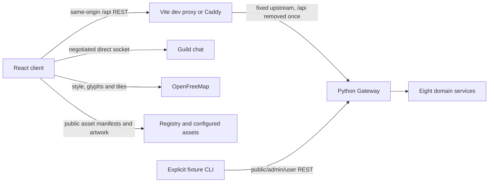

# Architecture and setup

## Stack and reasons

| Choice | Purpose and constraint |
|---|---|
| React + TypeScript | Interactive UI, typed API boundaries; one app |
| Vite | Local development and static production build; no server rendering requirement |
| React Router, declarative mode | Routes and lazy feature screens; no second application framework |
| TanStack Query | Server cache, paged reads, invalidation, abort signals and bounded polling |
| Native fetch | One typed transport; no second HTTP library |
| CSS Modules + CSS custom properties | Compact custom visual system, responsive styles and state variants |
| MapLibre GL JS + OpenFreeMap Liberty | Existing provider choice; preserve attribution, no geocoding |
| Lucide React | Coherent ordinary UI icons; licensed creature artwork stays coherent |
| Zod | Validate configuration/forms and critical external payloads with useful errors |
| Vitest + React Testing Library | Transport, reducers, forms and focused interaction tests |
| Playwright | Rendered browser flows, real integration and explicitly identified fixture tests |
| Caddy production runtime | Static assets, SPA fallback and fixed Gateway reverse proxy |

Use Node 24 LTS, currently supported according to the official release table.
Use npm, exact package versions and a committed package-lock.json. Select compatible
stable versions at bootstrap; record them in package.json and lockfile, then use
npm ci locally/CI/Docker. No floating CDN dependencies or automatic major updates.
The current planning checkout has no dependencies installed and no lockfile yet.

Next.js would add a server framework without a current rendering/data requirement.
Redux/global entity stores would duplicate server state. A native app would enlarge
the platform scope. Add them only if a concrete future requirement warrants it.
No monorepo, generated plugin framework, dependency injection container, generic
CRUD framework or package scripts that pretend unimplemented checks succeed.

## Runtime topology



The web server is a fixed reverse proxy, not a new business service or BFF.
It carries Authorization unchanged to Gateway. Gateway performs validation and
creates downstream assertions. /api/users/v1/... becomes /users/v1/... at Gateway;
Gateway removes /users before dispatch. Do not strip both prefixes in the client.
Never proxy arbitrary user-entered URLs or expose domain services as REST targets.

Direct Guild socket URLs come from negotiation, not from assumptions about Docker
DNS. HTTPS clients require wss and a reachable Guild endpoint configured by the
deployment. Do not silently rewrite arbitrary negotiation URLs. Verify allowed
origins/paths against public configuration. A local client and local Gateway are
not remotely reachable from a phone merely because localhost works on the laptop.

## Folder structure

```text
src/
  app/                 router, providers, session boundary
  components/          shared controls used by multiple features
  styles/              tokens, baseline, typography
  api/                 fetch transport, Problem, command keys, shared DTOs
  features/
    auth/ creatures/ explore/ social/ guilds/ battles/ raids/
    notifications/ account/ admin/ diagnostics/
  packages/            presentation JSON and resolver, ordinary data
public/
  assets/              artwork/fonts and their license/provenance files
  client-config.json   public runtime defaults only
scripts/               explicit fixture CLI and tooling
fixtures/              non-secret definitions and scenario descriptions
tests/                 unit helpers and e2e specifications
deploy/                Dockerfile, Caddyfile, standalone Compose
docs/                  bundled specification and implementation progress
```

Create folders when the first file is needed, not as an empty architecture diagram.
Each feature owns its API functions, query keys, components and DTOs. Reuse shared
primitives only for concrete repeated behaviour. Prefer direct composition.
Keep DTO snake_case to avoid conversion boilerplate. UI-only view models may use
ordinary TypeScript names, but never leak them into request JSON.

## State and transport

TanStack Query owns server records. React owns local UI state; a small session
provider owns in-memory credentials. URL owns list filters and selected entities.
No second store of collections, wallets or combat records. Query keys include
the user, endpoint, resource, filters and page size. Clear all queries on logout
or identity change. Do not persist authenticated query caches.

Set retry=false for mutations and initially for reads. Opt-in read retries are
bounded and exclude 400/401/403/404 and aborts. Set staleTime intentionally rather
than accepting a refetch storm. Poll only visible screens while document is visible:
active battle/raid 2 seconds, inbox 15 seconds; idle lists manual/focus refresh.
No Map background polling by default. Stop combat polling at terminal state;
reward settlement polling has a bounded window and manual Check status afterwards.

Pass TanStack AbortSignal to fetch. Unmount/logout cancels pending work. A local
request timeout is 10 seconds, deliberately above Gateway's default 5-second
budget. Combine local and caller abort signals and clean up timers. An aborted
mutation has an uncertain outcome; never assume it did not commit.

Use one UUIDv7 utility for command keys, chat IDs and correlation IDs. Browser
crypto.randomUUID() makes UUIDv4, so it cannot generate UUIDv7 correlation/chat IDs.
Use a maintained UUID package with v7 support or a small thoroughly tested utility,
not timestamp-shaped strings. Exact API details are in API.md.

## Configuration and commands

The implementation must provide these commands; they do not exist in this
planning checkout yet:

```text
npm ci
npm run dev
npm run lint
npm run typecheck
npm run test
npm run build
npm run test:e2e             controlled browser fixtures, no implicit real writes
npm run test:e2e:real        explicitly configured real test target
npm run fixtures -- --target ... --run-id ... --confirm-test-target
```

| Setting | Where | Meaning |
|---|---|---|
| GATEWAY_UPSTREAM | Vite server .env.local / Caddy environment | Fixed server-side upstream, default http://127.0.0.1:3000 |
| PUBLIC_CLIENT_ORIGIN | fixture CLI setting | Browser-reachable asset origin; never container localhost |
| api_base | public client-config.json | /api by default; no source edit required |
| map_style_url | public config | https://tiles.openfreemap.org/styles/liberty |
| map_default_center | public config | [28.8638,47.0105], a demo default, not a stored user location |
| diagnostics_enabled | public config | false by default |
| manual_location_enabled | public config | false by default; true only for demo/test |
| allowed_socket_origins | public config | Explicit browser-reachable Guild origins for this environment |
| package_presentations | public config | Known package IDs/version mappings to local presentation keys |
| push | public config, optional | Provider adapter configuration; disabled by default |

Load and validate runtime config before auth; missing optional values have safe
defaults. Public config contains no password, token, service secret or key. .env.example
contains placeholders/non-secret defaults; .env.local and .local/ are ignored.
Frontend VITE_* values are public; never put secrets there. Changing upstream in
packaged runtime should require restart, not a JavaScript rebuild.

Vite binds loopback by default on port 5173. Local phone use needs an explicitly
reachable host, secure context for location and a reachable socket address. Do not
weaken TLS to make mobile testing work. Package Docker runtime on port 8080 with
a fixed upstream and SPA deep-link fallback. API errors must never fall through
to index.html. Health of the web container checks its own process, not backend
integration. CI only tests/builds; image publication and remote setup are deferred.

## Session and privacy

Keep access and refresh tokens in memory; no localStorage/sessionStorage/IndexedDB
credentials, cookies, URLs or persisted diagnostics. This intentionally trades
reload persistence for a simple standalone browser client. If persistent login
is required later, design it separately rather than silently persisting tokens.

Decode expiry/roles only as UI hints; server verification remains authoritative.
Refresh shortly before expiry via one shared in-flight promise. Rotate both tokens
together. Public refresh/logout requests omit Authorization, so an expired bearer
cannot cause Gateway to refuse them before UM handles the refresh token. Preserve
the exact command/key on an authorized explicit retry; do not automatically replay
mutations after a 401. Stop auth loops on refresh refusal and return to login.

Logout attempts token revocation then clears local credentials/caches/sockets even
if unreachable. Explain when server-side revocation could not be confirmed. Never
log or export token responses, exact locations, emails or message content.

The same-origin proxy currently makes Gateway see the proxy peer address. Its
credential-attempt throttle ignores X-Forwarded-For, so all users behind the proxy
share that throttle budget. This is acceptable for the local demo; a public
deployment needs an agreed trusted-proxy/client-IP policy. Do not spoof headers
or change Gateway authentication policy from the client repository.

## Package presentation and assets

Backend packages are abstract. The public asset manifest gives sprite_ref URLs,
not labels, care rules or XP thresholds. Bundle a small versioned JSON presentation
file per supported demo package: display name, stat labels/types/units/ranges,
allowed care action identifiers and labels, action cooldown hints and local assets.
Fixture package definitions and presentation data share the same authored JSON
where practical, avoiding two copies of FEED/PLAY and stat bounds. The browser
does not fetch service-only /stat-definitions or /currency-rules.

Match package_id and config_version explicitly; unknown versions are not silently
rendered with incompatible care controls. Lookup sprite_ref by origin package
and config_version. Permit safe http URLs only in local test configuration, https
or same-origin paths elsewhere. Do not fetch an untrusted manifest as executable
code or render unsanitized SVG/HTML. Images use ordinary img and accessible fallback.

Serve bundled licensed assets from the client; see [ASSETS.md](ASSETS.md). For fixture manifests, publish absolute
URLs reachable both by browsers and, if needed, services. A relative URL or
localhost referring to a different container cannot be assumed to resolve. Boss
art needs a client sprite catalog: there is no separate boss-asset manifest API.
Registry package manifests are used where applicable; unresolved boss art falls
back honestly. Fonts ship locally with license files.

## Sources

- [React app setup](https://react.dev/learn/build-a-react-app-from-scratch)
- [Vite server proxy](https://vite.dev/config/server-options)
- [React Router declarative setup](https://reactrouter.com/start/declarative/installation)
- [TanStack Query](https://tanstack.com/query/latest/docs/framework/react/reference)
- [Node supported releases](https://nodejs.org/en/about/previous-releases)
- [OpenFreeMap integration](https://openfreemap.org/quick_start/)
- [Caddy proxy](https://caddyserver.com/docs/caddyfile/directives/reverse_proxy)
- [Lucide React](https://lucide.dev/guide/react/)
